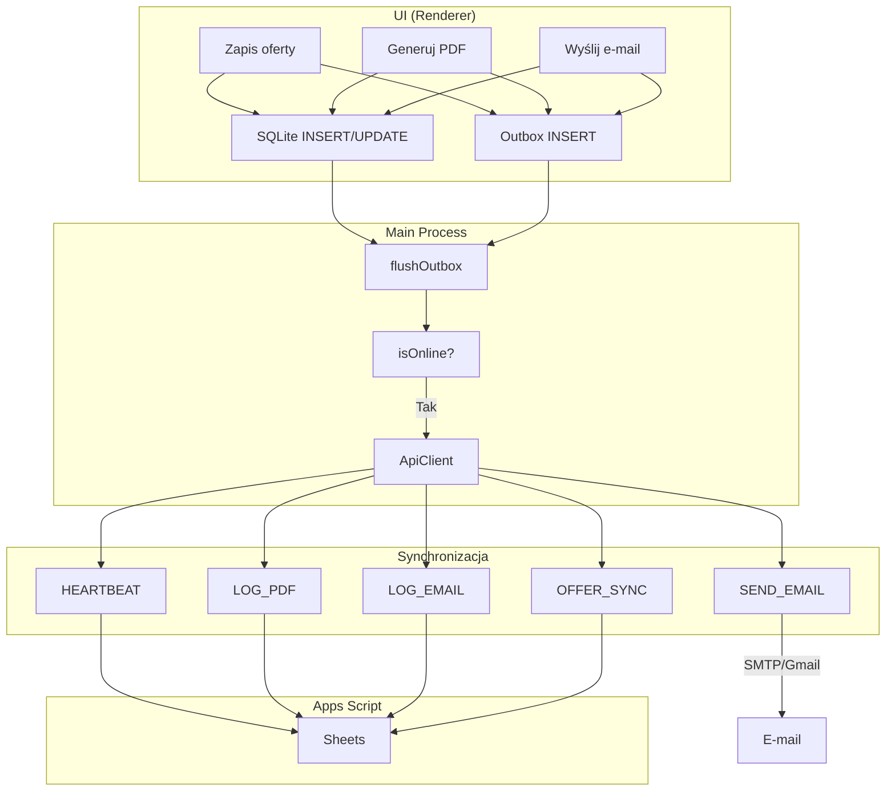

# Planlux Hale – Architektura ULTRA (CRM + Offline-First)

**Wersja:** 1.0  
**Data:** 2026-02-24  
**Stack:** Electron + Vite + Node + SQLite + Google Apps Script

---

## A) Struktura folderów (paths)

```
packages/
├── shared/
│   ├── src/
│   │   ├── api/              # Klient HTTP do Apps Script
│   │   │   ├── client.ts
│   │   │   └── types.ts
│   │   ├── crm/              # Typy CRM (Offer, EmailHistory, EventLog)
│   │   │   └── types.ts
│   │   ├── db/               # Schemat SQLite (shared)
│   │   │   └── schema.ts
│   │   ├── domain/           # Logika biznesowa (opcjonalnie)
│   │   │   ├── offerNumber.ts
│   │   │   └── duplicateCheck.ts
│   │   ├── pdf/              # Generator PDF, template
│   │   │   ├── generator.ts
│   │   │   ├── template.ts
│   │   │   └── generatePdfPayload.ts
│   │   ├── pricing/          # Silnik wyceny
│   │   │   ├── pricingEngine.ts
│   │   │   └── types.ts
│   │   ├── sync/             # Outbox, flush, idempotency
│   │   │   ├── outbox.ts
│   │   │   └── pricingSync.ts
│   │   └── index.ts
│   └── package.json
│
└── desktop/
    ├── electron/
    │   ├── main.ts
    │   ├── ipc.ts
    │   ├── preload.ts
    │   ├── db/               # Inicjalizacja DB, SQLCipher
    │   │   ├── initDb.ts
    │   │   └── keytar.ts
    │   ├── migrations/       # Migracje wersjonowane
    │   │   ├── crmMigrations.ts
    │   │   └── sqlcipherMigrations.ts
    │   ├── pdf/              # Pipeline PDF (printToPDF)
    │   │   ├── generatePdfFromTemplate.ts
    │   │   └── renderTemplate.ts
    │   └── sync/             # Flush outbox, sync offers
    │       └── offerSync.ts
    ├── src/
    │   ├── config.ts
    │   ├── logger.ts
    │   ├── db/               # Repozytoria (outboxStorage)
    │   │   └── outboxStorage.ts
    │   └── infra/            # baseSync, db helpers
    │       ├── baseSync.ts
    │       └── db.ts
    └── renderer/
        └── src/
            ├── app/
            ├── features/
            │   ├── kalkulator/
            │   ├── oferty/    # Zakładka Oferty
            │   ├── historia/
            │   └── admin/     # Panel Admina
            ├── state/
            └── theme/
```

---

## B) Schemat SQLite DDL

### B.1 Tabele bazowe (istniejące + rozszerzenia)

```sql
-- users: rozszerzenie o role
ALTER TABLE users ADD COLUMN role TEXT DEFAULT 'SALESPERSON';

-- offers_crm (alias offers w specyfikacji)
CREATE TABLE IF NOT EXISTS offers_crm (
  id TEXT PRIMARY KEY,
  offer_number TEXT NOT NULL,
  user_id TEXT NOT NULL REFERENCES users(id),
  status TEXT NOT NULL CHECK (status IN ('IN_PROGRESS', 'GENERATED', 'SENT', 'REALIZED')),
  created_at TEXT NOT NULL DEFAULT (datetime('now')),
  pdf_generated_at TEXT,
  emailed_at TEXT,
  realized_at TEXT,
  client_first_name TEXT NOT NULL DEFAULT '',
  client_last_name TEXT NOT NULL DEFAULT '',
  company_name TEXT NOT NULL DEFAULT '',
  nip TEXT NOT NULL DEFAULT '',
  phone TEXT NOT NULL DEFAULT '',
  email TEXT NOT NULL DEFAULT '',
  variant_hali TEXT NOT NULL,
  width_m REAL NOT NULL,
  length_m REAL NOT NULL,
  height_m REAL,
  area_m2 REAL NOT NULL,
  hall_summary TEXT NOT NULL DEFAULT '',
  base_price_pln REAL NOT NULL DEFAULT 0,
  additions_total_pln REAL NOT NULL DEFAULT 0,
  total_pln REAL NOT NULL DEFAULT 0,
  standard_snapshot TEXT NOT NULL DEFAULT '[]',
  addons_snapshot TEXT NOT NULL DEFAULT '[]',
  material_info TEXT DEFAULT '{}',
  note_html TEXT NOT NULL DEFAULT '',
  version INTEGER NOT NULL DEFAULT 1,
  updated_at TEXT NOT NULL DEFAULT (datetime('now'))
);
CREATE INDEX IF NOT EXISTS idx_offers_crm_user_id ON offers_crm(user_id);
CREATE INDEX IF NOT EXISTS idx_offers_crm_status ON offers_crm(status);
CREATE INDEX IF NOT EXISTS idx_offers_crm_offer_number ON offers_crm(offer_number);
CREATE INDEX IF NOT EXISTS idx_offers_crm_updated_at ON offers_crm(updated_at);
CREATE INDEX IF NOT EXISTS idx_offers_crm_created_at ON offers_crm(created_at);

-- email_history
CREATE TABLE IF NOT EXISTS email_history (
  id TEXT PRIMARY KEY,
  offer_id TEXT NOT NULL REFERENCES offers_crm(id),
  user_id TEXT NOT NULL REFERENCES users(id),
  from_email TEXT NOT NULL,
  to_email TEXT NOT NULL,
  subject TEXT NOT NULL,
  body TEXT NOT NULL,
  attachments_json TEXT NOT NULL DEFAULT '[]',
  sent_at TEXT,
  status TEXT NOT NULL CHECK (status IN ('QUEUED', 'SENT', 'FAILED')),
  error_message TEXT,
  created_at TEXT NOT NULL DEFAULT (datetime('now'))
);
CREATE INDEX IF NOT EXISTS idx_email_history_offer_id ON email_history(offer_id);
CREATE INDEX IF NOT EXISTS idx_email_history_user_id ON email_history(user_id);

-- event_log
CREATE TABLE IF NOT EXISTS event_log (
  id TEXT PRIMARY KEY,
  offer_id TEXT,
  user_id TEXT NOT NULL REFERENCES users(id),
  event_type TEXT NOT NULL,
  details_json TEXT NOT NULL DEFAULT '{}',
  created_at TEXT NOT NULL DEFAULT (datetime('now'))
);
CREATE INDEX IF NOT EXISTS idx_event_log_offer_id ON event_log(offer_id);
CREATE INDEX IF NOT EXISTS idx_event_log_user_id ON event_log(user_id);
CREATE INDEX IF NOT EXISTS idx_event_log_created_at ON event_log(created_at);

-- outbox (rozszerzony)
CREATE TABLE IF NOT EXISTS outbox (
  id TEXT PRIMARY KEY,
  idempotency_key TEXT UNIQUE,
  operation_type TEXT NOT NULL CHECK (operation_type IN (
    'SEND_EMAIL', 'LOG_PDF', 'LOG_EMAIL', 'HEARTBEAT', 'OFFER_SYNC', 'LOG_EVENT'
  )),
  payload_json TEXT NOT NULL,
  retry_count INTEGER NOT NULL DEFAULT 0,
  max_retries INTEGER NOT NULL DEFAULT 5,
  last_error TEXT,
  processed_at TEXT,
  created_at TEXT NOT NULL DEFAULT (datetime('now'))
);
CREATE INDEX IF NOT EXISTS idx_outbox_processed ON outbox(processed_at);
CREATE INDEX IF NOT EXISTS idx_outbox_created_at ON outbox(created_at);
CREATE INDEX IF NOT EXISTS idx_outbox_type ON outbox(operation_type);
CREATE INDEX IF NOT EXISTS idx_outbox_idempotency ON outbox(idempotency_key);

-- sync_state (opcjonalnie)
CREATE TABLE IF NOT EXISTS sync_state (
  id TEXT PRIMARY KEY DEFAULT 'default',
  device_id TEXT NOT NULL,
  last_sync_at TEXT,
  meta_pricing_version INTEGER DEFAULT 0,
  meta_offers_version INTEGER DEFAULT 0,
  updated_at TEXT NOT NULL DEFAULT (datetime('now'))
);
```

### B.2 SQLCipher – inicjalizacja

```sql
-- Wykonywane PRZED innymi operacjami (po otwarciu bazy)
PRAGMA key = '<KEY_FROM_KEYTAR>';
PRAGMA cipher_compatibility = 4;
PRAGMA cipher_page_size = 4096;
```

---

## C) Kontrakty TypeScript (interfaces/types)

### C.1 Offer

```typescript
// packages/shared/src/crm/types.ts

export type OfferStatus = "IN_PROGRESS" | "GENERATED" | "SENT" | "REALIZED";

export interface Offer {
  id: string;
  offerNumber: string;
  userId: string;
  status: OfferStatus;
  createdAt: string;
  pdfGeneratedAt: string | null;
  emailedAt: string | null;
  realizedAt: string | null;
  clientFirstName: string;
  clientLastName: string;
  companyName: string;
  nip: string;
  phone: string;
  email: string;
  variantHali: string;
  widthM: number;
  lengthM: number;
  heightM: number | null;
  areaM2: number;
  hallSummary: string;
  basePricePln: number;
  additionsTotalPln: number;
  totalPln: number;
  standardSnapshot: StandardItem[];
  addonsSnapshot: AddonItem[];
  materialInfo?: Record<string, unknown>;
  noteHtml: string;
  version: number;
  updatedAt: string;
}
```

### C.2 StandardItem (snapshot)

```typescript
export interface StandardItem {
  element: string;
  ilosc: number;
  jednostka: string;
  wartoscRef: number;
  pricingMode: "INCLUDED_FREE" | "CHARGE_EXTRA";
  selected: boolean;
}
```

### C.3 AddonItem (snapshot)

```typescript
export interface AddonItem {
  name: string;
  type: string;
  unit: string;
  quantity: number;
  m2?: number;
  pricePerUnit: number;
  total: number;
  free: boolean;
}
```

### C.4 EmailHistoryItem

```typescript
export type EmailHistoryStatus = "QUEUED" | "SENT" | "FAILED";

export interface EmailHistoryItem {
  id: string;
  offerId: string;
  userId: string;
  fromEmail: string;
  toEmail: string;
  subject: string;
  body: string;
  attachments: Array<{ name: string; path?: string }>;
  sentAt: string | null;
  status: EmailHistoryStatus;
  errorMessage: string | null;
  createdAt: string;
}
```

### C.5 EventLogItem

```typescript
export interface EventLogItem {
  id: string;
  offerId: string | null;
  userId: string;
  eventType: string;
  details: Record<string, unknown>;
  createdAt: string;
}
```

### C.6 OutboxItem

```typescript
export type OutboxOperationType =
  | "SEND_EMAIL"
  | "LOG_PDF"
  | "LOG_EMAIL"
  | "HEARTBEAT"
  | "OFFER_SYNC"
  | "LOG_EVENT";

export type OutboxStatus = "PENDING" | "PROCESSING" | "FAILED" | "DONE";

export interface OutboxItem {
  id: string;
  idempotencyKey: string | null;
  entityType: string;
  entityId: string;
  operationType: OutboxOperationType;
  payloadJson: string;
  attemptCount: number;
  status: OutboxStatus;
  lastAttemptAt: string | null;
  errorMessage: string | null;
  createdAt: string;
}
```

---

## D) Spec API (Apps Script)

### D.1 Routing (doPost / doGet)

| Akcja | Metoda | Endpoint | Opis |
|-------|--------|----------|------|
| meta | GET | `?action=meta` | META (version, lastUpdated, offersVersion) |
| base | GET | `?action=base` | Cennik, dodatki, standard |
| logPdf | POST | body.action=logPdf | Log PDF |
| logEmail | POST | body.action=logEmail | Log e-mail |
| heartbeat | POST | body.action=heartbeat | Aktywność |
| offers | GET | `?action=offers&lastSync=ISO` | Oferty zmodyfikowane po dacie |
| offer | POST | body.action=offer | Create/update oferty (idempotentne) |
| emailHistory | POST | body.action=emailHistory | Zapis historii maila |
| emailHistory | GET | `?action=emailHistory&offerId=X` | Historia dla oferty |
| counters | GET | `?action=counters&userId=X&year=YYYY` | Licznik ofert |
| reserveNumber | POST | body.action=reserveNumber | Atomowa rezerwacja numeru |
| duplicates | GET | `?action=duplicates&query=<base64 JSON>` | Wyszukiwanie duplikatów |
| dashboard | GET | `?action=dashboard&period=YYYY-MM` | Agregaty per handlowiec |

### D.2 Payloady request/response

#### POST reserveNumber

```json
{
  "action": "reserveNumber",
  "payload": {
    "id": "req-uuid",
    "idempotencyKey": "reserve-<userId>-<timestamp>",
    "userId": "user-uuid",
    "year": 2026
  }
}
```

**Response 200:**
```json
{
  "ok": true,
  "offerNumber": "PLX-E0001/2026",
  "id": "req-uuid"
}
```

#### GET offers?lastSync=2026-02-20T00:00:00Z

**Response 200:**
```json
{
  "ok": true,
  "offers": [
    {
      "id": "offer-uuid",
      "offerNumber": "PLX-E0001/2026",
      "userId": "user-uuid",
      "status": "GENERATED",
      "updatedAt": "2026-02-21T10:00:00Z",
      "...": "..."
    }
  ],
  "meta": { "offersVersion": 42 }
}
```

#### POST offer (idempotentne)

```json
{
  "action": "offer",
  "payload": {
    "id": "offer-uuid",
    "idempotencyKey": "offer-<id>-<version>",
    "offerNumber": "PLX-E0001/2026",
    "userId": "user-uuid",
    "status": "GENERATED",
    "version": 2,
    "updatedAt": "2026-02-21T10:00:00Z",
    "...": "..."
  }
}
```

**Response 200:**
```json
{
  "ok": true,
  "id": "offer-uuid",
  "offerNumber": "PLX-E0001/2026",
  "version": 2
}
```

**Idempotency:** Backend sprawdza `idempotencyKey`; jeśli istnieje – zwraca 200 bez zmiany.

#### GET duplicates?query=<base64>

Query (JSON, base64):
```json
{
  "firstName": "Jan",
  "lastName": "Kowalski",
  "companyName": "Firma ABC",
  "nip": "1234567890",
  "phone": "48123456789"
}
```

**Response 200:**
```json
{
  "ok": true,
  "matches": [
    {
      "offerId": "offer-uuid",
      "offerNumber": "PLX-E0042/2025",
      "userId": "user-uuid",
      "userDisplayName": "Jan Kowalski",
      "createdAt": "2025-11-15T10:00:00Z"
    }
  ]
}
```

#### GET dashboard?period=2026-02

**Response 200:**
```json
{
  "ok": true,
  "period": "2026-02",
  "byUser": [
    {
      "userId": "user-uuid",
      "displayName": "Jan Kowalski",
      "created": 12,
      "sent": 8,
      "realized": 3
    }
  ]
}
```

### D.3 Błędy

| Kod | Znaczenie |
|-----|-----------|
| VALIDATION_ERROR | Nieprawidłowy payload |
| CONFLICT | Konflikt wersji (version) |
| DUPLICATE_IDEMPOTENCY | IdempotencyKey już przetworzony – zwróć poprzedni wynik |
| UNAUTHORIZED | Brak tokena / nieprawidłowy token |
| RATE_LIMIT | Zbyt wiele żądań |

```json
{
  "ok": false,
  "error": "Invalid payload",
  "code": "VALIDATION_ERROR"
}
```

### D.4 META – rozszerzenie

```json
{
  "ok": true,
  "meta": {
    "version": 158,
    "lastUpdated": "2026-02-20T23:36:24.726Z",
    "offersVersion": 42
  }
}
```

---

## E) Diagram przepływu offline→sync (Mermaid)



### Kolejność flush outbox

1. HEARTBEAT  
2. LOG_PDF  
3. SEND_EMAIL (jeśli online + sendEmail)  
4. LOG_EMAIL  
5. OFFER_SYNC  
6. LOG_EVENT  

---

## F) Strategia migracji bazy

### F.1 Wersjonowane migracje

| Wersja | Plik | Opis |
|--------|------|------|
| 1 | `crmMigrations.ts` | offers_crm, email_history, event_log, outbox OFFER_SYNC |
| 2 | `sqlcipherMigrations.ts` | PRAGMA key, cipher_compatibility |
| 3 | `syncStateMigration.ts` | sync_state |
| 4 | `outboxIdempotencyMigration.ts` | outbox.idempotency_key |
| 5 | `usersRoleMigration.ts` | users.role (SALESPERSON/MANAGER/ADMIN) |

### F.2 Kolejność wdrożenia (MVP → full)

**Faza 1 – MVP (obecny stan)**  
- [x] offers_crm, email_history, event_log  
- [x] Outbox OFFER_SYNC  
- [x] Zakładka Oferty  
- [x] Auto-save, before-quit  

**Faza 2 – SQLCipher + Keytar**  
- [ ] Keytar: generowanie i przechowywanie klucza  
- [ ] Przełączenie na @journeyapps/sqlcipher lub better-sqlite3-sqlcipher  
- [ ] Migracja: PRAGMA key przy inicjalizacji  

**Faza 3 – Backend Apps Script**  
- [ ] Arkusze: Offers, EmailHistory, Events, Counters  
- [ ] Endpointy: reserveNumber, offers, offer, duplicates, dashboard  
- [ ] Idempotency po idempotencyKey  

**Faza 4 – Pełna synchronizacja**  
- [ ] OFFER_SYNC w flushOutbox  
- [ ] sync_state (lastSyncAt, meta_offers_version)  
- [ ] TEMP→final offerNumber przy sync  

**Faza 5 – Panel Admina + Dashboard**  
- [ ] Role: SALESPERSON, MANAGER, ADMIN  
- [ ] ACL w IPC  
- [ ] Dashboard z Chart.js  

---

## G) Checklist testów

### G.1 Offline

- [ ] Tworzenie oferty offline → zapis w SQLite  
- [ ] Generowanie PDF offline → zapis w SQLite + outbox LOG_PDF  
- [ ] Wysyłka e-mail offline → email_history QUEUED + outbox SEND_EMAIL, LOG_EMAIL  
- [ ] Numer TEMP-xxx offline  
- [ ] Wyszukiwanie ofert offline (filtry, search)  

### G.2 Crash recovery

- [ ] Zamknięcie podczas zapisu → dane spójne po restarcie  
- [ ] before-quit / window close → zapis draftu  
- [ ] powerMonitor suspend → autoSave + event AUTO_LOGOUT  

### G.3 Retry / backoff

- [ ] Błąd sieci przy flush → retry z backoff  
- [ ] max_retries przekroczone → markFailed, nie blokuje kolejki  
- [ ] Kolejność HEARTBEAT → LOG_PDF → SEND_EMAIL → LOG_EMAIL → OFFER_SYNC  

### G.4 Konflikty

- [ ] Last Write Wins: version + updatedAt  
- [ ] Duplikat idempotencyKey → 200 bez zmiany  

### G.5 TEMP → final offerNumber

- [ ] Offline: TEMP-&lt;deviceId&gt;-&lt;ts&gt;  
- [ ] Sync: POST offer z TEMP → backend zwraca finalny numer  
- [ ] Aktualizacja offers_crm.offer_number  
- [ ] Aktualizacja PDF metadata (jeśli wymagane)  

### G.6 Bezpieczeństwo

- [ ] NIP/telefon/email nie w logach plain text  
- [ ] SQLCipher: baza nieczytelna bez klucza  
- [ ] Keytar: klucz w systemowym sejfie  

---

## H) Kolejność commitów (1..N)

| # | Commit | Minimalne zmiany |
|---|--------|------------------|
| 1 | `feat(db): add sync_state table migration` | sync_state DDL |
| 2 | `feat(db): add outbox idempotency_key column` | outbox migration |
| 3 | `feat(api): add reserveNumber, offers, offer endpoints to ApiClient` | shared/api/client.ts |
| 4 | `feat(api): add duplicates, dashboard, counters to types` | shared/api/types.ts |
| 5 | `feat(crm): add materialInfo to Offer, extend StandardItem/AddonItem` | shared/crm/types.ts |
| 6 | `feat(sync): add OFFER_SYNC handler to flushOutbox` | shared/sync/outbox.ts |
| 7 | `feat(desktop): SQLCipher init + keytar key storage` | electron/db/initDb.ts |
| 8 | `feat(desktop): offer sync to backend on flush` | electron/sync/offerSync.ts |
| 9 | `feat(ui): duplicate check modal before save` | renderer checkDuplicates |
| 10 | `feat(ui): EmailComposer component` | renderer EmailComposer |
| 11 | `feat(ui): Admin panel users + activity` | renderer AdminPanel |
| 12 | `feat(ui): Manager dashboard with Chart.js` | renderer Dashboard |
| 13 | `feat(ipc): enforce role ACL for admin/dashboard` | electron/ipc.ts |
| 14 | `feat(pdf): add addons section + materialInfo to template` | shared/pdf/template.ts |
| 15 | `chore: Apps Script backend – Offers, Counters, reserveNumber` | (osobny repo/Deploy) |

---

## Załącznik: users – rozszerzenie

```sql
-- users: from_email, email_provider (opcjonalnie)
ALTER TABLE users ADD COLUMN from_email TEXT;
ALTER TABLE users ADD COLUMN email_provider TEXT CHECK (email_provider IN ('GMAIL', 'SMTP'));
-- Tokeny OAuth / hasła SMTP tylko w keytar – NIE w DB
```
